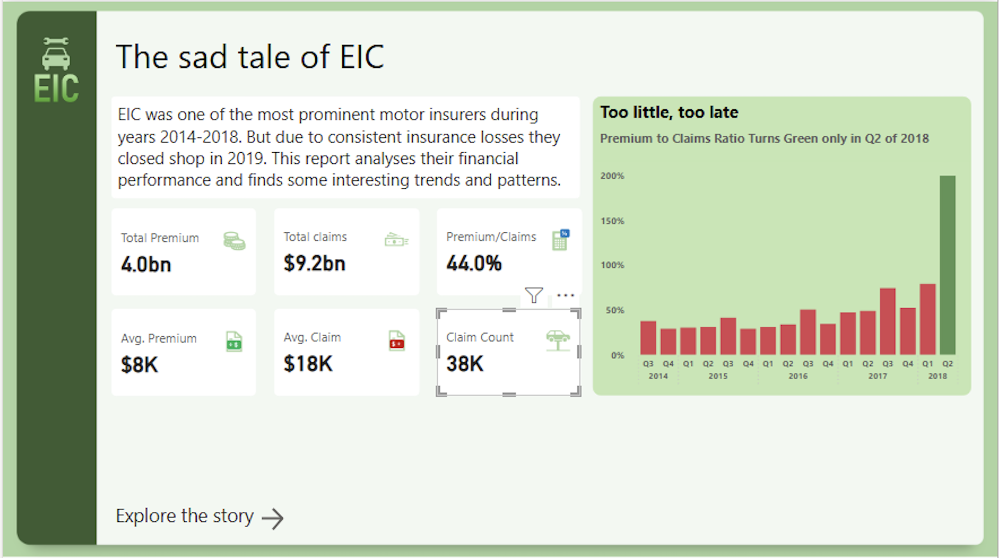
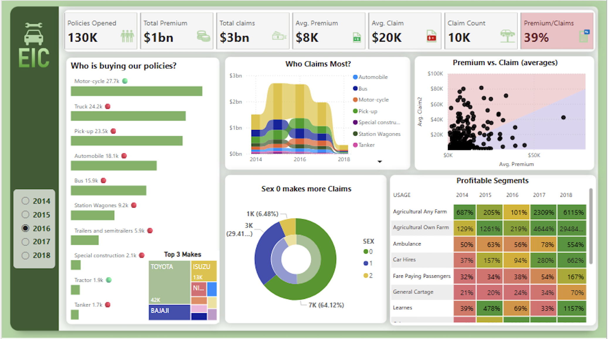

# The Sad Tale of EIC - Insurance Dashboard in Power BI

This project explores the story of EIC, a once-prominent motor insurance company that operated between 2014 and 2018. Despite having a strong customer base, EIC faced increasing losses year after year and ultimately shut down in 2019. Using Power BI, this analysis uncovers the financial trends, claim patterns, and segment performances that led to its collapse.

---

## Project Overview

The analysis aims to answer key questions such as:

- Were premiums sufficient to cover the claims?
- Which customer segments contributed to the most claims?
- Were there any areas of profitability at all?
- How did EIC’s performance vary over the years?

---

## Key Insights

- EIC collected $4B in premiums but paid out $9.2B in claims.
- The average Premium-to-Claim ratio was only 44%, far below sustainability.
- Only one profitable quarter was observed - Q2 of 2018.
- Most policies were sold for motorcycles and trucks.
- Agricultural segments, although small in volume, delivered the highest profitability.

---

## Dashboard Features

- Year-wise slicer for dynamic filtering (2014–2018)
- KPIs for premiums, claims, and average values
- Policy distribution by vehicle type, segment, and make
- Gender-wise claims breakdown
- Profitability heatmap by vehicle usage type over 5 years
- Scatter plot for average premium vs. average claim

---

## Dashboard Previews

### Welcome Page

### Report Page

---

## Skills Demonstrated

- Power BI report design and storytelling
- DAX measures for KPIs (e.g., claim ratios, averages)
- Conditional formatting and dynamic visuals
- Analytical thinking to connect data with business decisions
- Identifying loss patterns and profitable opportunities

---

## Final Thoughts

This dashboard is more than just a collection of charts - it's a visual narrative of how key metrics can tell the story of a business's rise and fall. It highlights the importance of understanding customer segments, pricing strategies, and risk exposure in the insurance industry.  

The project reflects how data visualization can simplify complex business challenges and drive actionable insights.

